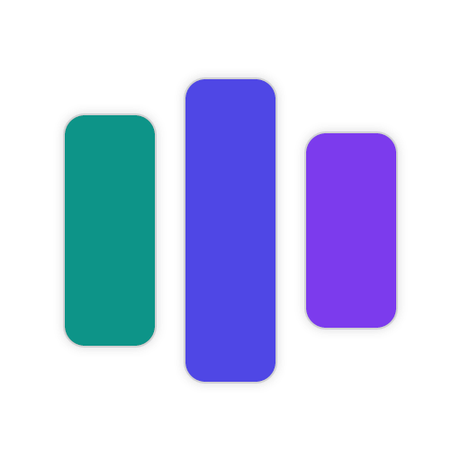

<p align="center">
  
</p>

# aimo — AI model orchestrator

**Route the right model to the right job** — plan, execute, and review with **different models (and backends) per stage**, so cheap and fast models handle what they excel at and premium models see **summarized, high-signal context** when it matters.

AI pricing and quotas are shifting: blanket “all tasks on the flagship model” workflows get expensive fast. aimo is built for the next phase — **intelligent orchestration** over raw token burn.

> The era of assuming infinitely cheap API access is ending. aimo helps you **compose** providers (local, hosted, OpenRouter-style gateways, whatever you wire in) instead of paying flagship rates for every step.

## What you get today

- **YAML profiles** — bind **plan**, **execute**, and **review** independently (`provider`, `model`, optional `base_url` per LLM stage).
- **Merged config** — `~/.config/ai-model-orchestrator/config.yaml` plus repo-local `./aimo.yaml` (deep merge; project wins).
- **Artifacts on disk** — each run under `.aimo/runs/<id>/` (e.g. `plan.md`, review output, manifest).
- **Bun + TypeScript CLI** — `plan` → `execute` → `review` pipelines, `--json` for automation, `--dry-run` to validate bindings.

**Where we are:** Phase 0 vertical slice. Plan and review stages use the in-repo **`fake`** chat provider for smoke tests and CI; the config and port layout are meant to grow into HTTP adapters (OpenAI-compatible and friends), local inference, and a future **lab bench** (compare profiles, cost inspection — see roadmap). If you want real LLMs today, you extend or plug the same boundaries — the thesis is **pluggable stages**, not a single hard-coded vendor.

**Roadmap and backlog:** [`docs/ai/roadmap.md`](./docs/ai/roadmap.md)

## Install

End-to-end command catalog and recipes live in [`USAGE.md`](./USAGE.md). Three install paths:

### 1. Standalone binary (no Bun required) — `curl` or `wget`

```sh
# auto-detects platform, installs to ~/.local/bin/aimo (override AIMO_INSTALL_DIR)
curl -fsSL https://raw.githubusercontent.com/agjs/ai-model-orchestrator/main/scripts/install-aimo.sh | bash
```

Or pick the asset directly from [Releases](https://github.com/agjs/ai-model-orchestrator/releases/latest):

```sh
# example: macOS ARM
curl -fsSLo aimo https://github.com/agjs/ai-model-orchestrator/releases/latest/download/aimo-darwin-arm64
chmod +x aimo && mv aimo /usr/local/bin/aimo
aimo --version
```

Builds are produced by [`bun build --compile`](https://bun.com/docs/bundler/executables) from a tagged commit and attached to the GitHub Release as `aimo-<os>-<arch>`. No Bun runtime needed on the target machine.

### 2. Bun global (recommended for contributors)

Requires [Bun](https://bun.sh/) `>=1.2.0` (this repo pins `bun@1.3.13`).

```sh
git clone https://github.com/agjs/ai-model-orchestrator.git
cd ai-model-orchestrator
bun install
bun link                # registers the `aimo` bin from package.json globally
aimo --help
```

Make sure Bun's global bin (`~/.bun/bin` by default) is on your `PATH`.

### 3. Run from a checkout (no install)

```sh
bun install
bun src/app/cli.ts --help
```

Same flags as the installed binary; useful when hacking on the CLI itself.

## Quick start

```sh
aimo init --json                       # writes ~/.config/ai-model-orchestrator/config.yaml + ./aimo.yaml
aimo doctor --json                     # validates merged config
aimo ping --json                       # one fake chat completion (smoke)
aimo plan "your task" --json           # planner stage → .aimo/runs/<uuid>/plan.md
aimo run "your task" --json            # plan → execute → review (with delegated profile)
aimo run "your task" --dry-run --json  # validate config + bindings only
aimo --help
```

See [`USAGE.md`](./USAGE.md) for the full per-command reference, exit codes, and recipes.

**Config:** See [`docs/ai/roadmap.md`](./docs/ai/roadmap.md) (Milestone A) and `ConfigLoader.bun.ts` JSDoc for merge rules.

**Check setup:** `bun src/app/cli.ts doctor` (human summary) or `bun src/app/cli.ts doctor --json` (machine-readable; exit `5` on invalid config per `ExitCodes`).

## Docs for contributors

- [`AGENTS.md`](./AGENTS.md) — architecture, boundaries, JSDoc, anti-patterns, workflows
- [`CLAUDE.md`](./CLAUDE.md) — quick pointer + same rules for Claude Code sessions
- [`docs/ai/`](./docs/ai/) — roadmap, architecture, contribution contract, conventions, security model, catalog
- [`CONTRIBUTING.md`](./CONTRIBUTING.md) — short contribution guide

API reference (early scaffold): run `bun run docs` → HTML in `dist/docs/` (ignored by git).

## License

MIT — see [`LICENSE`](./LICENSE).
