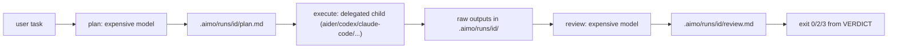

# aimo — Usage

End-to-end guide for the `aimo` CLI: install, configure, run, inspect.

This document describes the shipped CLI, including **`workers`** and **`pipeline.shrinkers`**. See [`docs/ai/roadmap.md`](docs/ai/roadmap.md) for what is next.

- [Install](#install)
- [Configuration](#configuration)
- [The pipeline at a glance](#the-pipeline-at-a-glance)
- [Commands](#commands)
- [Cheap subagents (workers)](#cheap-subagents-workers)
- [Run-directory layout](#run-directory-layout)
- [Exit codes](#exit-codes)
- [Recipes](#recipes)
- [Troubleshooting](#troubleshooting)

---

## Install

Three ways. Pick whichever fits.

### 1. Standalone binary (no Bun required)

One-liner that detects your platform, downloads the latest Release asset, and drops `aimo` on `PATH`:

```sh
curl -fsSL https://raw.githubusercontent.com/agjs/ai-model-orchestrator/main/scripts/install-aimo.sh | bash
```

Override defaults via env: `AIMO_VERSION=v0.3.0`, `AIMO_INSTALL_DIR=/usr/local/bin`, `AIMO_REPO=...`.

Or fetch one asset directly:

```sh
curl -fsSLo aimo \
  https://github.com/agjs/ai-model-orchestrator/releases/latest/download/aimo-darwin-arm64
chmod +x aimo && mv aimo /usr/local/bin/aimo
```

Assets: `aimo-{linux,darwin}-{x64,arm64}` produced by `bun build --compile` from a tagged commit. No Bun runtime needed on the target machine.

### 2. Bun global (recommended for contributors)

Requires [Bun](https://bun.sh/) `>=1.2.0` (this repo pins `bun@1.3.13`).

```sh
git clone https://github.com/agjs/ai-model-orchestrator.git
cd ai-model-orchestrator
bun install
bun link              # registers `aimo` from package.json bin
aimo --help
```

Make sure Bun's global bin (`~/.bun/bin` by default) is on your `PATH`.

### 3. Run from a checkout (no install)

```sh
bun install
bun src/app/cli.ts --help
```

Same flags as the installed binary. Useful when hacking on the CLI itself.

---

## Configuration

Two YAML layers, deep-merged with **project wins**:

| Layer | Path | Purpose |
| ----- | ---- | ------- |
| User  | `~/.config/ai-model-orchestrator/config.yaml` | Personal defaults across all projects (provider, models, API base URLs). |
| Project | `./aimo.yaml` (repo root) | Profile + delegated executor + project-specific overrides. |

`aimo init` writes both starters; safe to edit by hand.

### Minimal `aimo.yaml`

```yaml
schema_version: 1
default_profile: default
profiles:
  default:
    plan:
      provider: openrouter         # or `fake` for smoke tests
      model: anthropic/claude-sonnet-4
      base_url: https://openrouter.ai/api/v1
    execute:
      type: delegated
      command: ["aider", "--yes-always", "--message-file", "{plan_path}"]
    review:
      provider: openrouter
      model: anthropic/claude-sonnet-4
```

### Secrets (`.env`)

Read by `aimo` from `~/.aimo/.env` then `./.env` (project wins). Common keys:

```dotenv
OPENROUTER_API_KEY=sk-or-...
OPENAI_API_KEY=sk-...                 # also accepted by openai-compat providers
ANTHROPIC_API_KEY=sk-ant-...
```

Never commit `./.env`.

### Token sentinels

In delegated `command:` arrays the literal token `{plan_path}` is replaced by the absolute path to `plan.md` for that run. Example:

```yaml
command: ["codex", "exec", "--input-file", "{plan_path}"]
```

If you want the plan piped on stdin instead, set `stdin_file: "{plan_path}"` on the execute stage.

---

## The pipeline at a glance



- **Plan** turns a user task into a structured `plan.md` with steps for the executor.
- **Execute** spawns whatever CLI you put in `command:` with `cwd` at the repo root. Captures stdout, stderr, and `git diff HEAD` before/after.
- **Review** reads the plan and the execute artifacts and writes `review.md` ending in `VERDICT: pass | changes_requested | fail`.

You can run the full pipeline with `aimo run`, or step by step with `aimo plan` + `aimo execute --run <id>` + `aimo review --run <id>`.

---

## Commands

Common flags: every command accepts `--json` (machine-readable single line on stdout) and exits with a code from the [`Exit codes`](#exit-codes) table.

### `aimo init`

Writes starter YAML files if missing.

```sh
aimo init                     # both files
aimo init --global-only       # only ~/.config/ai-model-orchestrator/config.yaml
aimo init --local-only        # only ./aimo.yaml
aimo init --force             # overwrite existing files
aimo init --json
```

### `aimo doctor`

Validates merged YAML and prints which paths were used.

```sh
aimo doctor
aimo doctor --json
```

Exits `5` (`EXIT_CONFIG_ERROR`) on schema violations.

### `aimo ping`

One round-trip through the in-process fake provider. CI smoke test.

```sh
aimo ping
aimo ping --json
```

### `aimo plan <task>`

Runs the planner only. Writes `.aimo/runs/<id>/plan.md` and `manifest.json`.

```sh
aimo plan "Add input validation to the user form"
aimo plan "..." --profile experimental
aimo plan "..." --json        # prints { run_id, plan_path, manifest_path, markdown }
```

### `aimo execute --run <id>`

Runs the delegated executor against the plan from a previous `aimo plan` (or fresh `aimo run`). Captures `git diff HEAD` before and after, writes `execute.result.json`.

```sh
aimo execute --run 9f3c8e22
aimo execute --run 9f3c8e22 --json
```

### `aimo review --run <id>`

Reviewer chat against `plan.md` + the diff artifacts. Writes `review.md`. Process exit code maps from the verdict (0 / 2 / 3).

```sh
aimo review --run 9f3c8e22
aimo review --run 9f3c8e22 --json
```

### `aimo run [task]`

Full pipeline (plan → execute → review) in one command. Slice with `--from` / `--to`. Resume an existing run with `--run <id>` (required when not starting at `plan`).

```sh
aimo run "Add input validation to the user form"
aimo run "Resume run 9f3c8e22" --run 9f3c8e22 --from execute
aimo run "Re-review only" --run 9f3c8e22 --from review --to review
aimo run "..." --dry-run                 # validate config only, no artifacts
aimo run "..." --json
aimo run "..." --no-keep-raw             # delete raw context files after shrinking (overrides YAML)
```

`--dry-run` validates: stage range parses, profile is present, plan/execute/review providers resolve, run-id is safe (when not starting at plan), workers and shrinker references resolve.

---

## Cheap subagents (workers) <a id="cheap-subagents-workers"></a>

Spec and acceptance criteria: [`docs/ai/spec-cheap-workers.md`](docs/ai/spec-cheap-workers.md).

The expensive model should never read raw command output. The pattern: **cheap workers** read large blobs (logs, diffs, fetch bodies, grep hits) and emit bounded summaries that the expensive model consumes through delimited `DATA` blocks.

### Configuration

```yaml
workers:
  log_squeezer:
    provider: openrouter
    model: mistralai/mistral-small
    max_chars_in: 200000
    max_chars_out: 4000
  diff_summarizer:
    provider: openrouter
    model: mistralai/mistral-small
    max_chars_in: 400000
    max_chars_out: 6000

pipeline:
  keep_raw: true                       # default; --no-keep-raw flips per run
  shrinkers:
    - { source: execute.stdout,         worker: log_squeezer }
    - { source: execute.stderr,         worker: log_squeezer }
    - { source: execute.git_diff_after, worker: diff_summarizer }
```

### What a run looks like

```text
run: starting run 9f3c8e22 (plan → execute → review)
plan: claude-sonnet-4 via openrouter — 1.4k prompt / 0.9k completion tokens
execute: aider exited 0 (12.4s, 47 turns)
shrink execute.stdout      via log_squeezer:    184k -> 3.1k chars
shrink execute.stderr      via log_squeezer:     22k -> 0.4k chars
shrink execute.git_diff_after via diff_summarizer: 311k -> 5.8k chars
review: claude-sonnet-4 via openrouter — VERDICT: pass
run: finished run 9f3c8e22 exit 0
```

### Source enum

`source:` values are validated against an enum in `core/`. v1 ships:

| Source | Produced by | Default suggested worker |
| ------ | ----------- | ------------------------ |
| `execute.stdout`           | execute stage | `log_squeezer` |
| `execute.stderr`           | execute stage | `log_squeezer` |
| `execute.git_diff_after`   | execute stage | `diff_summarizer` |

Future stages (Phase A `aimo fetch`, Phase B grep) extend the enum without touching wiring.

### Why keep raw on disk?

Default is `keep_raw: true` so you can:

- **Audit** what really happened when a verdict is suspicious.
- **Re-shrink** with a different worker model without re-running execute.
- **Measure quality** of the cheap worker by comparing raw vs shrunk.

Pass `--no-keep-raw` (or set `pipeline.keep_raw: false`) to drop raw artifacts after their `*.shrunk.md` counterparts are written.

### Sidecar

Each run writes `.aimo/runs/<id>/workers.json`:

```json
{
  "schema_version": 1,
  "run_id": "9f3c8e22",
  "calls": [
    {
      "source": "execute.git_diff_after",
      "worker": "diff_summarizer",
      "provider": "openrouter",
      "model": "mistralai/mistral-small",
      "chars_in": 311022,
      "chars_out": 5840,
      "prompt_tokens": 78000,
      "completion_tokens": 1460,
      "truncated_in": false
    }
  ]
}
```

Cost-in-USD lands later (Milestone B).

---

## Run-directory layout

A successful `aimo run` with shrinkers configured:

```
.aimo/runs/9f3c8e22/
  plan.md                              # planner output
  manifest.json                        # plan stage record
  execute.result.json                  # exit + argv + diff capture errors
  execute.stdout                       # raw, kept by default unless --no-keep-raw
  execute.stderr
  execute.git_diff_after.diff
  execute.stdout.shrunk.md             # what review actually read when shrinkers ran
  execute.stderr.shrunk.md
  execute.git_diff_after.shrunk.md
  git.diff.before.txt                  # repo state before execute
  git.diff.after.txt                   # repo state after execute
  review.md                            # ends with VERDICT: ...
  workers.json                         # one row per worker call
```

Without shrinkers: only the raw / current files exist; review reads the diff straight.

---

## Exit codes

| Code | Meaning |
| ---: | ------- |
| `0`   | Success / review **pass** |
| `1`   | Operational error (I/O, network, unexpected) |
| `2`   | Review **changes_requested** |
| `3`   | Review **fail** |
| `4`   | Budget exceeded (Milestone B) |
| `5`   | Config error (invalid YAML, missing profile, unsupported provider) |
| `6`   | Dirty working tree (e.g. `compare` without `--allow-dirty`) |
| `130` | User cancelled (SIGINT) |

Defined in [`src/core/contracts/ExitCodes.constants.ts`](src/core/contracts/ExitCodes.constants.ts). All commands and tests use these constants — no magic numbers in product code.

---

## Recipes

### Drive `aider` from a stronger planner / reviewer

```yaml
profiles:
  default:
    plan:
      provider: openrouter
      model: anthropic/claude-sonnet-4
    execute:
      type: delegated
      command: ["aider", "--yes-always", "--message-file", "{plan_path}"]
    review:
      provider: openrouter
      model: anthropic/claude-sonnet-4
```

```sh
aimo run "Implement feature X per docs/spec.md"
```

### Step through with eyes-on at each gate

```sh
aimo plan "Implement feature X" --run feat-x --json
$EDITOR .aimo/runs/feat-x/plan.md         # tweak if needed
aimo execute --run feat-x
git diff                                  # eyeball the changes
aimo review --run feat-x
```

### Re-review only after a manual fix

```sh
$EDITOR src/...                           # apply the small fix yourself
aimo review --run 9f3c8e22                # re-runs shrinkers + review
```

### Validate config without spending tokens

```sh
aimo run "anything" --dry-run --json
```

### Use a different profile for a one-off

```sh
aimo run "..." --profile experimental
```

### CI gate on review verdict

```yaml
# .github/workflows/aimo.yml (sketch)
- run: aimo run "${{ inputs.task }}" --json > run.json
- run: |
    code=$?
    case $code in
      0) echo "pass" ;;
      2) echo "changes_requested"; exit 1 ;;
      3) echo "fail";              exit 1 ;;
      *) echo "infra error $code"; exit 1 ;;
    esac
```

---

## Troubleshooting

| Symptom | Likely cause | Fix |
| ------- | ------------ | --- |
| `aimo --version` returns `0.0.0` from a binary | Binary built from a pre-release commit | Re-install with `AIMO_VERSION=vX.Y.Z` |
| `EXIT_CONFIG_ERROR` from `doctor` | Invalid YAML or unknown provider | Run `aimo doctor --json` and read the issue list |
| `EXIT_CONFIG_ERROR` from `run --dry-run` after adding workers | Shrinker references a `worker:` not in `workers:` map | Fix the name; dry-run validates references |
| Review never finishes | Expensive model is reading raw 300k diff | Configure a `diff_summarizer` worker (see above) |
| `bun link` did not put `aimo` on `PATH` | `~/.bun/bin` not on `PATH` | Add `export PATH="$HOME/.bun/bin:$PATH"` |
| Install script complains "not on PATH" | `$AIMO_INSTALL_DIR` not on `PATH` | Follow the script's printed `export PATH=...` line |

For deeper internals (architecture, layering, file naming) see [`AGENTS.md`](AGENTS.md). For roadmap status see [`docs/ai/roadmap.md`](docs/ai/roadmap.md).
