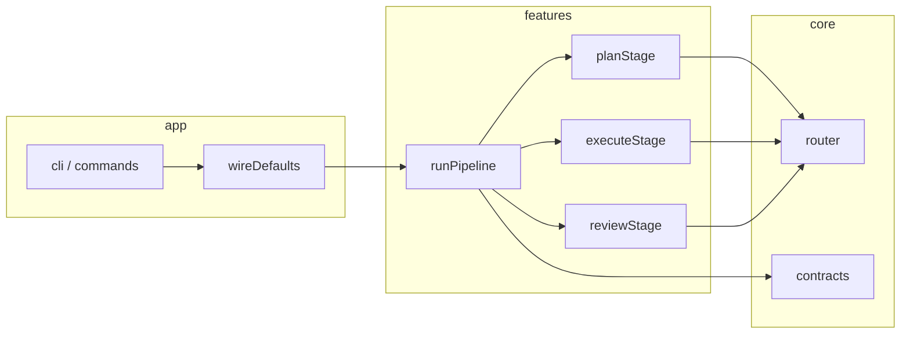

# Architecture

`aimo` (package name **ai-model-orchestrator**) is a **Bun + TypeScript CLI** with two roles:

1. **Orchestrator** — run a **plan → execute → review** pipeline, routing each stage to a configured model (via named **profiles**).
2. **Lab bench** — compare profiles (e.g. `aimo compare`) using isolated git worktrees and metrics-only scorecards.

## Layered design

| Layer        | Path               | Role |
| ------------ | ------------------ | ---- |
| `app`        | `src/app/`         | **Composition root only** — wires Bun adapters, providers, and features. The only layer that imports `@runtime/*`. |
| `features`   | `src/features/`    | Orchestrators (`runPipeline`, stages, compare). Receives **ports** and registries via parameters — **no** `@runtime` imports. |
| `runtime`    | `src/runtime/`     | Bun-backed I/O: fs, shell, http, clock, env loader, signals, atomic writes, git helpers. Implements `@core/ports` interfaces. |
| `providers`  | `src/providers/`   | LLM adapters (OpenAI-compat, Anthropic, fake). Uses `IHttpPort`; declares **capabilities**. **No** `@runtime` imports. |
| `core`       | `src/core/`        | **Pure** logic: router, config merge rules, contracts, security helpers, observations, manifest math. **No** `process`, `Bun`, `fetch`, wall-clock, or `Math.random`. |
| `shared`     | `src/shared/`      | Leaf types, errors, constants, and **in-memory test fakes** (`shared/test-fakes/`). May import `@core` for port **types** only (fakes implement ports). |

Enforced by **eslint-plugin-boundaries** and **dependency-cruiser** (see root configs).

## Single-run pipeline (target)

## Milestones (delivery order)

Summary only — **checklist and status:** [roadmap.md](./roadmap.md).

- **Milestone A** — Vertical slice: `init`, fake provider, `plan`, delegated `execute`, `review`, `run --dry-run`, `run`, `doctor`, step commands; all against **fake** provider in CI.
- **Milestone B** — Lab bench: `compare`, `replay`, `models`, `clean`, `inspect-cost`, aux commands.
- **Milestone C** — Minimal **builtin** executor (read/write only) + coverage sweep.

## Further reading

- [roadmap.md](./roadmap.md) — ordered backlog (what to build next)
- [contribution-contract.md](./contribution-contract.md) — non‑negotiables
- [conventions.md](./conventions.md) — naming and file suffixes
- [security-model.md](./security-model.md) — trust boundaries and secrets
- [catalog.md](./catalog.md) — module index (fill as code lands)
