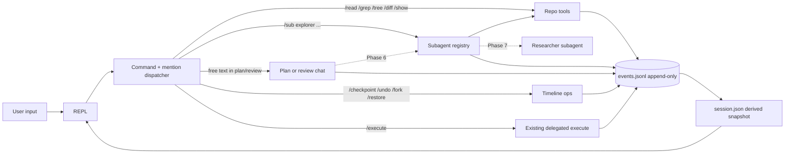

# Spec — `aimo session` (interactive subagent loop)

Status: **draft / not implemented**. This is the Phase 0 paper artifact for the `aimo session` initiative. No code lands without an update here first.

## 1. Goals (in scope)

- Long-lived REPL (`aimo session`) that survives plan / execute / review and lets the user iterate, fork, and recover.
- **Repo-aware by default**: read files, grep, list, diff, reference with `@` mentions — before any web feature.
- **Append-only event log** as source of truth; `session.json` is a derived snapshot. Resume / replay / checkpoint / undo are all reductions over events.
- **Typed subagent registry**: subagents have role, model profile, tools, transcript, and budget. Slash commands and (later) model tool-calls dispatch to the same registry.
- **Permissions** (`allow | ask | deny`) for every tool/subagent, persisted as `approval` events.
- **Streaming assistant text** when the provider supports it. Tool-calling stays request/response in v1.

## 2. Non-goals (v1)

- No TUI / Ink / panes (plain readline + colored stderr via existing `RunProgressStderrStyle.bun.ts`).
- No native in-process execute agent. `aimo execute` keeps delegating to aider/codex/etc.
- No MCP, no embedding index, no repo embeddings.
- No web research in v1 (Phase 7).
- No multi-user / RBAC.
- File mutations from inside the session — only via `aimo execute`. No `/edit`, no model-driven `write_file` in v1.

## 3. Decisions (locked here so we stop re-litigating)

| # | Decision | Rationale |
|---|----------|-----------|
| D1 | `@`-mentions are **lazy by default** (rendered as tool calls the model can choose to make); `@plan` and `@diff` are eager (small, always relevant). | Keeps context tight; avoids two parallel context-injection paths once Phase 6 lands. |
| D2 | Approvals derive from `approval` events. **No `approvals.json` sidecar.** | Single source of truth; no sync hazard. |
| D3 | `aimo run` **bypasses** session machinery in v1 (no events.jsonl). Session-recorded runs are `aimo session` + `/run`. | Stops session bookkeeping from creeping into the one-shot path. |
| D4 | `ISubagentDefinition.tools` is `readonly TToolName[]` (typed union), not `readonly string[]`. | AGENTS.md: no `unknown`/free strings for tagged values. |
| D5 | Subagents run **fresh** — no parent transcript. Parent passes context via the subagent's `inputSchema`. | Bounded token usage; explicit contract. |
| D6 | `pipeline.shrinkers` rows **compile** to `{ subagent: 'shrinker', input: { source } }` at YAML load. | Runtime sees only subagent calls; existing tests stay green. |
| D7 | Tool-calling extends `IChatCompletionRequest` with optional `tools?` (no new method). Providers without function-calling ignore it. | Less port surface. |
| D8 | Streaming is opt-in capability `IChatCompletionPort.completeStream?`. | Falls back transparently when absent. |
| D9 | File mutations are out of scope for v1 (see §2). | Smaller blast radius; aider/codex remain the editor. |

## 4. On-disk layout

```text
.aimo/sessions/<sessionId>/
  events.jsonl              # source of truth, append-only
  session.json              # derived snapshot, rewritten on quiescence
  blobs/<hash>.<ext>        # spilled bodies for events > 256 KB
  .lock                     # flock sentinel; prevents concurrent resume
```

Sessions live alongside `.aimo/runs/`. A session may be bound to zero or more runs (via `/use <runId>`).

## 5. Event log

### 5.1 Wire format

JSONL. Each line is one event. Every event carries:

```ts
interface IEventEnvelope<TKind extends string, TPayload> {
  readonly schema_version: 1;
  readonly seq: number;            // strictly increasing per session
  readonly at: string;             // ISO 8601
  readonly kind: TKind;
  readonly prev_hash?: string;     // sha256 of prior line; optional in v1, slot reserved
  readonly payload: TPayload;
}
```

### 5.2 Event union (Phase 1 set)

| `kind` | When emitted |
|--------|--------------|
| `session_start` | First event; carries cli version, cwd, profile name. |
| `user_turn` | User submitted a line (free text or slash). |
| `assistant_turn` | Model finished a turn (post-stream). |
| `tool_call` | A tool was invoked (slash or model-initiated). |
| `tool_result` | Tool completed; large bodies spill to `blobs/`. |
| `approval` | User decision for a permission prompt. |
| `stage_transition` | Mode changed: `idle ↔ plan ↔ review ↔ free`. |
| `artifact_write` | A file under `.aimo/runs/<id>/` was written. |
| `cancelled` | Turn aborted via SIGINT or `/cancel`. |
| `error` | Recoverable error path (e.g. `tool_iteration_limit`). |

Phase 4 adds: `checkpoint`, `compacted`, `fork`, `branched_from`.
Phase 5 adds: `subagent_call`, `subagent_result`.

### 5.3 Integrity rules

- Events are written `O_APPEND`, one line per write, `\n`-terminated.
- A torn final line on read is **dropped with a warning**, not fatal.
- `seq` is strictly increasing; gaps abort resume with a clear error.
- Per-event size cap: **256 KB**. Larger bodies spill: the event records `{ body_ref: 'blobs/<sha256>.<ext>', body_bytes: N }` instead of inlining.
- `events.jsonl` is never rewritten in place. Compaction (Phase 4) appends a `compacted` event summarizing a range; the original lines stay.

### 5.4 Concurrency

- `aimo session resume <id>` acquires `.lock` (advisory flock) before opening for append. Refuses with a clear error if held.
- One process per session. Cross-process collaboration is out of scope.

## 6. Reducer shape

```ts
interface ISessionState {
  readonly sessionId: string;
  readonly mode: 'idle' | 'plan' | 'review' | 'free' | 'streaming';
  readonly head: number;                  // index into events; advanced by /undo
  readonly labels: Readonly<Record<string, number>>;   // checkpoint label → seq
  readonly branches: Readonly<Record<string, number>>; // branchId → branched_from seq
  readonly boundRunId: string | null;
  readonly history: readonly IChatMessage[];           // active branch transcript
  readonly approvals: Readonly<Record<TToolName, 'allow' | 'session' | 'never' | 'deny'>>;
  readonly todos: readonly { id: string; text: string; done: boolean }[];
  readonly usageTotal: { prompt_tokens: number; completion_tokens: number; calls: number };
  readonly pendingApproval: { tool: TToolName; reason: string } | null;
}
```

`sessionReducer.behavior.ts` is **pure** `(state, event) => state`. Lives in `src/core/session/`. Fully unit-tested before any I/O lands.

## 7. Layering

| Path | Responsibility |
|------|----------------|
| `core/session/SessionEvents.types.ts` | Discriminated event union + envelope. |
| `core/session/sessionReducer.behavior.ts` | Pure `(state, event) => state`. |
| `core/repoTools/RepoToolNames.constants.ts` | `TToolName` union. |
| `core/repoTools/RepoToolSchemas.behavior.ts` | Per-tool zod schemas. |
| `core/repoTools/expandMention.behavior.ts` | `@…` → typed mention descriptor (no I/O). |
| `core/subagents/SubagentDefinition.types.ts` | `ISubagentDefinition` + result type. |
| `core/subagents/SubagentRegistry.behavior.ts` | Pure registry / lookup. |
| `features/sessionLoop.feature.ts` | Read line → dispatch → emit events → persist. |
| `features/runSubagent.feature.ts` | Build messages, run tools, account usage. |
| `features/planChatLoop.feature.ts` | Multi-turn planner; no disk writes. |
| `features/reviewChatLoop.feature.ts` | Multi-turn reviewer; no disk writes. |
| `runtime/bun/SessionEventLog.bun.ts` | Append-only `events.jsonl` + lock + blob spill. |
| `runtime/bun/RepoToolsBun.bun.ts` | `IRepoToolsPort` adapter (fs / git / rg). |
| `app/commands/session.command.ts` | Registers `aimo session` / `aimo session resume <id>`. |
| `app/session/sessionRepl.app.ts` | Readline + prompt + colored output only. |

## 8. Cross-cutting rules (apply to all phases)

1. **Cancellation.** Every model call, every subagent, every long tool runs under an `AbortController` rooted at the REPL turn. SIGINT or `/cancel` aborts → `cancelled` event → return to prompt. Partial assistant streams are **not persisted** as `assistant_turn`.
2. **Tool result truncation.** `read_file` accepts `{ path, offset?, limit?, max_bytes? }` (default `max_bytes` ≈ 64 KB). On truncation: result body carries `truncated: true, total_lines: N`. `grep`: `{ pattern, glob?, max_matches? (default 200), context_lines? }`. `list_tree`: `max_entries`.
3. **Permissions UX.** `ask` prompts `[a]llow once / [s]ession / [n]ever / [d]eny once`. Decisions become `approval` events. The reducer applies them to `state.approvals` (D2).
4. **Cost / usage accounting.** Reducer maintains `usageTotal` and per-subagent breakdown. `/status` reads from there. `maxCostUsd` is enforced against this when a token-cost source is wired (until then, soft turn/char caps).
5. **Streaming state machine.** `idle → streaming → idle | cancelled`. `/lock` and most slash commands are denied while `streaming`.
6. **Path safety.** All filesystem-touching tools resolve via `realpath` + `isPathInsideRoot.behavior.ts` (already shipped).
7. **Test triplet, every phase.** Reducer additions get unit tests; loop additions get integration tests with fakes; user-visible commands get e2e tests via spawned `aimo session` driving lines through stdin.

## 9. Phases

### Phase 0 — this document

Land `docs/ai/spec-session.md`, add roadmap entry, no code.

### Phase 1 — event log + REPL shell

- Event union (Phase 1 subset, §5.2), reducer, on-disk layout, lock, blob spill.
- `aimo session` (new), `aimo session resume <id>`.
- Slash set: `/help [cmd]`, `/status`, `/use <runId>`, `/cancel`, `/exit`, `/resume`.
- `/status` shape: `session id, mode, bound run id, last checkpoint (—), usageTotal, pending approval`.
- Tests: reducer unit; loop integration (fake chat, fake fs); `cliSession.e2e.test.ts` driving stdin.

### Phase 2 — repo tools + `@`-mentions

- Tools: `read_file`, `grep`, `list_tree`, `git_status`, `git_diff`, `show_artifact`.
- Slash forms: `/read`, `/grep`, `/tree`, `/diff`, `/show`.
- `@`-mention expansion (D1) — lazy `@src/foo.ts`; eager `@plan` / `@diff` / `@review` / `@run:<id>`.
- YAML schema add (additive, no `schema_version` bump):
  ```yaml
  session:
    tools:
      read_file: allow
      list_tree: allow
      grep: allow
      git_status: allow
      git_diff: allow
      show_artifact: allow
      apply_patch: deny
      run_shell: deny
      web_search: deny
  ```
- `/approvals` lists/clears.

### Phase 3 — multi-turn plan / review (+ optional streaming)

- `planChatLoop.feature.ts` and `reviewChatLoop.feature.ts`.
- **Refactor**: split `runPipelineWritePlanStep.app.ts` into `core/plan/composePlanArtifacts.behavior.ts` (pure) + `runtime/bun/RunWorkspace.bun.ts` write step. Both the loop and the existing one-shot path call the pure composer.
- `/lock` writes plan artifacts via the composer + writer.
- Streaming: optional `IChatCompletionPort.completeStream?` (D8). Tokens stream to stderr; `assistant_turn` event only on completion. `/lock` denied while streaming.

### Phase 4 — checkpoints / undo / fork / todos / compact

- Reducer data shape (§6) covers `head`, `labels`, `branches`.
- Slash: `/checkpoint [label]`, `/undo`, `/restore <label>`, `/fork [--new-session]`, `/diff plan`, `/todo`, `/todo add "…"`, `/todo done <n>`, `/compact`.
- **Compaction invariant**: `/undo` across a `compacted` range is **refused** with a clear error; never silently produces garbage.
- **Fork default**: same-session new branch (cheap). `--new-session` clones run dir + opens a new session linked by a `fork` event.

### Phase 5 — subagent registry

- `ISubagentDefinition`:
  ```ts
  interface ISubagentDefinition<TInput> {
    readonly name: string;
    readonly description: string;
    readonly modelProfile: string;          // key into workers: in YAML
    readonly tools: readonly TToolName[];   // D4
    readonly inputSchema: z.ZodType<TInput>;
    readonly maxTurns: number;
    readonly maxCharsIn?: number;
    readonly maxCharsOut?: number;
    readonly maxCostUsd?: number;           // soft until cost source wired
  }
  ```
- Result:
  ```ts
  interface ISubagentResult {
    readonly outcome: 'ok' | 'limited' | 'error';
    readonly markdownOut: string;
    readonly usage: IChatCompletionUsage;
    readonly charsIn: number;
    readonly charsOut: number;
    readonly turnsUsed: number;
    readonly toolsUsed: readonly TToolName[];
  }
  ```
- Presets: `explorer` (read_file, grep, list_tree, git_diff), `shrinker` (current behavior, refactored).
- Subagents run **fresh** (D5); parent passes context via `inputSchema`.
- YAML compile step: existing `pipeline.shrinkers` rows → `{ subagent: 'shrinker', input: { source } }` (D6). `cliRunWorkers.e2e.test.ts` stays green.
- Sidecar `subagents.json` (or extended `workers.json`) records the `ISubagentResult` shape.
- Slash: `/sub <name> <freeText|json>`.

### Phase 6 — model tool-calling over the same registry

- Extend `IChatCompletionRequest` with optional `tools?: ITool[]` (D7); `IChatMessage` adds optional `tool_calls?` and `role: 'tool'` with `tool_call_id`.
- Provider lift: OpenAI-compat passes `tools` through and surfaces `tool_calls`. Fake provider gets a deterministic stub.
- Tool list per stage = same registry that backs slash commands.
- Loop in `planChatLoop` / `reviewChatLoop`: tool_calls → registry (with permissions) → `tool` messages → re-call. `max_tool_iterations` hit → `error` event with `code: 'tool_iteration_limit'`, end turn cleanly.
- Per-tool budgets: `{ max_calls_per_turn, max_total_chars }`. Budget exceeded → tool result is an error message the model sees, not a crash.
- Gated per stage with `tools_enabled: true` AND per-provider capability check.

### Phase 7 — researcher subagent (deferred)

- New `runtime/workers/searchWorker.bun.ts` behind `IUrlFetchPort` + `IReadablePort` (Mozilla Readability + linkedom/jsdom — TBD).
- Backend: one of Brave / SerpAPI / Tavily — user picks.
- Off by default (`web_search: deny`).
- **Locked output contract** even though deferred:
  ```ts
  interface IResearchDigest {
    readonly markdown: string;
    readonly sources: readonly { url: string; title: string; fetched_at: string }[];
  }
  ```

## 10. Mental model



## 11. Risks / open questions

- **Provider tool-calling parity.** OpenRouter exposes function-calling for many models, not all. Phase 6 stays opt-in per stage; per-provider capability check is required.
- **Streaming + readline UX.** Token redraw vs prompt cursor. Small POC needed before committing the API.
- **Cost source.** Until we wire token pricing, `maxCostUsd` is decorative; turn count + char caps are the real bound.
- **`schema_version` of YAML.** All Phase-1..5 YAML additions are additive; no bump. Phase 6 introduces tools in chat requests but the YAML side stays compatible. Bump only when ledger shape (events.jsonl schema) changes destructively.

## 12. Out of scope (explicit)

TUI panes, MCP, native in-process execute agent, repo embeddings, multi-user, RBAC, web research before Phase 7, file mutations from inside the session.
